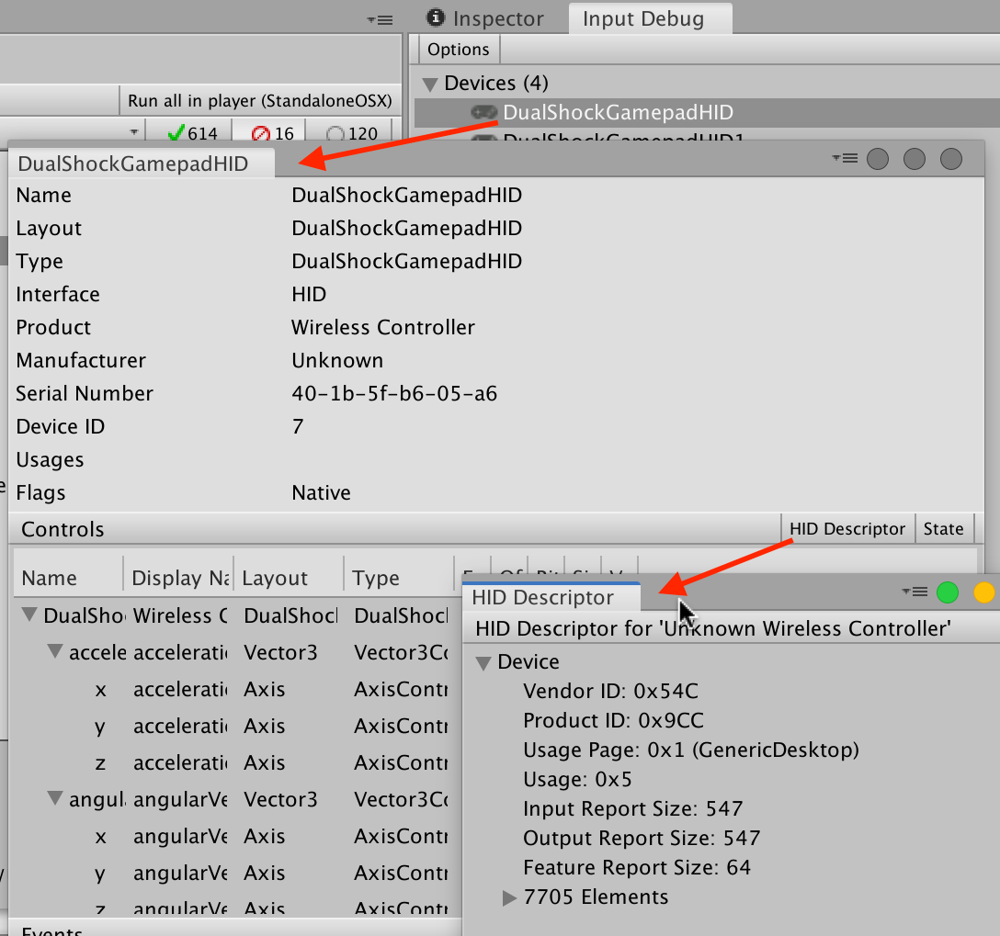

    ////WIP

# HID Support

[HIDs](https://www.usb.org/hid) (both via USB and via Bluetooth) are directly supported on Windows, MacOS, and UWP. On other platforms, HIDs may be supported but not delivered through HID-specific APIs (example: on Linux, gamepad and joystick HIDs are supported through SDL; other HIDs are not supported).

Every HID comes with a descriptor that describes the device. The descriptor of a HID can be browsed through from the input debugger by pressing the "HID Descriptor" button in the device debugger window.

HIDs are handled in one of two ways:

1. The system has a known layout for the specific HID.
2. A layout is auto-generated for the HID on the fly.

...

HID input is received as plain, unaltered HID input reports as received directly from the device or driver.

## HID Joysticks

## HID Gamepads

## Other HIDs

## HID Output

Output reports can be sent to any HID by using the `HIDO` command. For an example, see `DualShockHIDOutputReport`.
